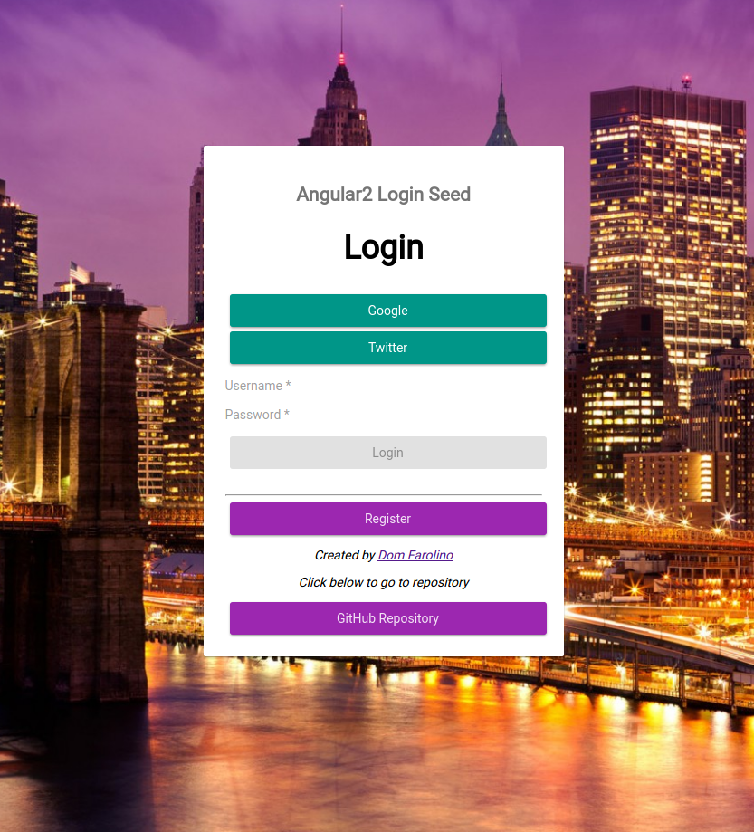
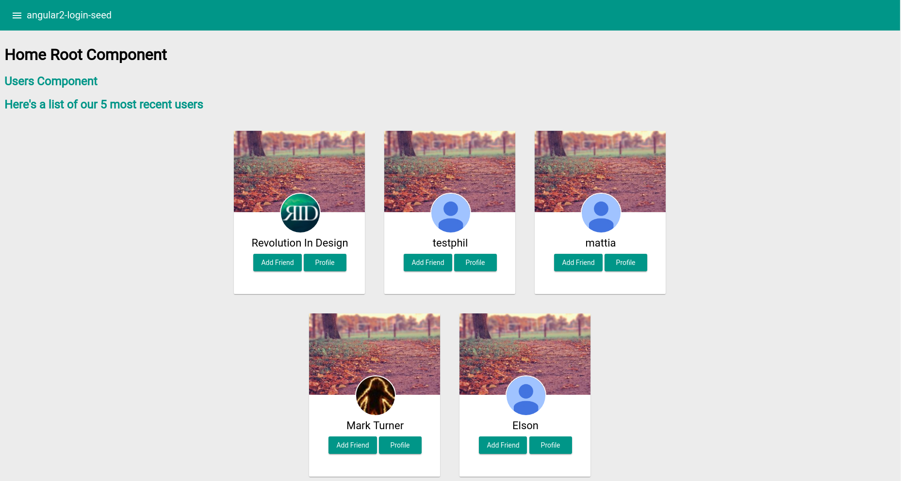

#angular2-login-seed

[](http://opensource.org/licenses/MIT)
[](https://david-dm.org/domfarolino/angular2-login-seed)
[](https://david-dm.org/domfarolino/angular2-login-seed#info=devDependencies)
[](https://camo.githubusercontent.com/495f5e3a82030e6bd99569430828c46591cfe8bf/68747470733a2f2f6d6765636865762e6769746875622e696f2f616e67756c6172322d7374796c652d67756964652f696d616765732f62616467652e737667)

A seed application for developers to get started building applications with Angular 2. The application's backend is in Node.js featuring user login via PassportJS and OAuth.

[](https://github.com/domfarolino/angular2-login-seed)

## Table of Contents

  1. [Demo](#demo)
  1. [Technologies](#technologies)
  1. [Overview](#overview)
  1. [TL;DR Get started now](#tldr-get-started-now)
  1. [Customizing Express server](#customizing-express-server)
  1. [Angular Component Tree](#angular-component-tree)
  1. [Directory Structure](#directory-structure)
  1. [Contributing](#contributing)
  1. [Todo](#todo)

## Demo
Check this site out live [here](https://domfarolino.com/angular2-login-seed)

## Technologies
Some of the open source technologies used in this application are listed below
  1. [Angular 2](https://angular.io/)
  1. [Angular CLI](https://cli.angular.io/)
  1. [Angular Material2](https://material.angular.io/)
  1. [Node.js](https://nodejs.org/)
  1. [Express](http://expressjs.com/)
  1. [PassportJS](http://passportjs.org/)

## Overview

This repository contains code for ***two*** applications:

 - The Angular app which gets served by the [angular-cli](https://github.com/angular/angular-cli) via `ng serve` on `localhost:4200`
 - The Express server on which the Angular app depends which is served via `npm run express-dev` or `npm run express-prod` on `localhost:5000`

**It is only necessary to run the Angular app locally** to get up and running. This is because by default the Angular app depends on the
remote Express server which has been deployed on Heroku. There is no need for you worry about setting up OAuth accounts, SQL Databases, or
remote servers. This stuff is only necessary if you wish to change the API to be your own. Steps for this can be found in the [Customizing Express server](#customizing-express-server) section.

## TL;DR Get started now

Make sure you have `angular-cli` installed globally `npm install -g angular-cli@latest`.

```sh
# Fork or clone this repo
git clone git@github.com:domfarolino/angular2-login-seed.git
npm install
npm start
```

Navigate to `localhost:4200` and you should see the following application served:



Once you login you will see the following screen:



## Customizing Express server

I've tried to make it easy to customize your the Express server to make it your own. Only the following steps need completed:

 - Create OAuth appliations with Google and Twitter. You can follow my [guide here](https://chinocode.com/Registering-An-OAuth-App/)
 - Input the application credentials in the `config/default.json` configuration file
 - Create a local or production database in which the application will store the `users`.
 - Execute the contents of `angular2-login-seed.sql` on the database to create a users table with proper fields
 - Fill out `config/default.json`, `config/production.json`, or both with db credentials to that `Sequelize` knows how to connect when you're in development or production mode
 - Change the production OAuth callbacks found in `config/production.json`
 - Change the api url to your new server

> To learn about how the npm package `config` works with Node environment variables click [here](https://www.npmjs.com/package/config)

```sh
npm run express-dev # runs express server in development mode with development specified credentials
npm run express-prod # runs express server in production mode using credentials overwritten in production.json
```

I've also tried to make it as easy as possible to add more OAuth providers to this app to keep
it flexible. If you think it can be done better please submit a PR to improve the maintainability
of the app. To add support for another OAuth provider 4 things need to be done:

##### 1. Add authorization and callback routes for the provider (edit `/routes/index.js`)
```
/**
 * Authorization route for <provider> provider
 */
router.get('/authorize/provider',
  passport.authenticate('provider'));

/**
 * Define our provider callback endpoint and success/failure methods
 */
router.get('/callback/provider',
	passport.authenticate('provider', {
		successRedirect: '/',
		failureRedirect: '/provider'
}));
```
##### 2. Add your OAuth credentials to the `/config/default.json` file. You'll use these in `/config/passport.js` which you'll edit next

##### 3. Setup/use PassportJS strategy in `/config/passport.js`
```
passport.use(new ProviderStrategy({....
```

##### 4. Update the attribute utility functions at the end of `/config/passport.js` to support your provider

This entails basically examining the JSON payload you get back from your provider and seeing
under what keys, the information you need to insert into the database exists under. If any database/model
changes need made modify the database appropriately and update the User model `/models.js`

##### 5. Update the apiBase to use your own server

The current api endpoint is listed as a provided value in the /src/app/app.module.ts file. You must change the api url (currently 'https://angular2-login-seed.herokuapp.com') to the url of your own api server.


## Angular Component Tree


## Directory Structure
The goal is to keep as flat of a directory structure as possible for all of the Angular components. Reasons for this, as well as grouping files by bounded context can be found [here](https://github.com/mgechev/angular2-style-guide#directory-structure).

```
.
├─login-screenshot.png
├─angular-cli.json
├─logo.png
├─96.png
├─192.png
├─Procfile
├─144.png
├─.editorconfig
├─package.json
├─protractor.conf.js
├─tslint.json
├─e2e
│   ├─app.e2e-spec.ts
│   ├─e2e
│   │   ├─app.po.ts
│   │   ├─tsconfig.json
│   │   ├─typings.d.ts
│   │   ├─app.e2e.ts
│   ├─app.po.ts
│   ├─tsconfig.json
├─.gitignore
├─angular2-login-seed.sql
├─karma.conf.js
├─README.ng.md
├─src
│   ├─favicon.ico
│   ├─polyfills.ts
│   ├─styles.css
│   ├─app
│   │   ├─app.component.css
│   │   ├─register
│   │   │   ├─register.component.css
│   │   │   ├─register.component.ts
│   │   │   ├─register.component.js
│   │   │   ├─register.component.js.map
│   │   │   ├─register.component.html
│   │   │   ├─index.ts
│   │   ├─shared
│   │   │   ├─components
│   │   │   │   ├─quick-card
│   │   │   │   │   ├─quick-card.component.css
│   │   │   │   │   ├─quick-card.component.html
│   │   │   │   │   ├─quick-card.component.js
│   │   │   │   │   ├─quick-card.component.js.map
│   │   │   │   │   ├─quick-card.component.ts
│   │   │   ├─services
│   │   │   │   ├─user
│   │   │   │   │   ├─user.service.js.map
│   │   │   │   │   ├─user-status-codes.js.map
│   │   │   │   │   ├─user.service.js
│   │   │   │   │   ├─username-email-validator.ts
│   │   │   │   │   ├─user.js.map
│   │   │   │   │   ├─user.service.ts
│   │   │   │   │   ├─username-email-validator.js
│   │   │   │   │   ├─user.ts
│   │   │   │   │   ├─user-status-codes.ts
│   │   │   │   │   ├─user-status-codes.js
│   │   │   │   │   ├─username-email-validator.js.map
│   │   │   │   │   ├─user.js
│   │   │   │   ├─hero
│   │   │   │   │   ├─hero.js.map
│   │   │   │   │   ├─hero.service.js
│   │   │   │   │   ├─hero.ts
│   │   │   │   │   ├─hero.service.js.map
│   │   │   │   │   ├─hero.service.ts
│   │   │   │   │   ├─hero.js
│   │   ├─home-root
│   │   │   ├─home-root.component.html
│   │   │   ├─home-root.component.js
│   │   │   ├─home-root.routes.ts
│   │   │   ├─home-root.guard.ts
│   │   │   ├─index.ts
│   │   │   ├─home-root.component.js.map
│   │   │   ├─home-root.component.ts
│   │   │   ├─home-root.component.css
│   │   ├─users
│   │   │   ├─user-badge.component.css
│   │   │   ├─users.component.ts
│   │   │   ├─user-badge.component.js.map
│   │   │   ├─users.component.js
│   │   │   ├─user-badge.component.js
│   │   │   ├─user-badge.component.ts
│   │   │   ├─users.component.css
│   │   │   ├─users.component.js.map
│   │   │   ├─user-badge.component.html
│   │   │   ├─users.component.html
│   │   │   ├─index.ts
│   │   ├─app.component.html
│   │   ├─dashboard
│   │   │   ├─dashboard.component.ts
│   │   │   ├─dashboard.component.js.map
│   │   │   ├─dashboard.component.js
│   │   │   ├─dashboard.component.html
│   │   ├─app.component.ts
│   │   ├─app-routing.module.ts
│   │   ├─app.module.ts
│   │   ├─login
│   │   │   ├─login.component.css
│   │   │   ├─login.component.ts
│   │   │   ├─login.component.html
│   │   │   ├─login.component.js
│   │   │   ├─login.component.js.map
│   │   │   ├─index.ts
│   │   ├─app.component.spec.ts
│   │   ├─hero-detail
│   │   │   ├─hero-detail.component.js
│   │   │   ├─hero-detail.component.css
│   │   │   ├─hero-detail.component.html
│   │   │   ├─hero-detail.component.js.map
│   │   │   ├─hero-detail.component.ts
│   │   ├─heroes
│   │   │   ├─heroes.component.html
│   │   │   ├─heroes.component.js
│   │   │   ├─heroes.component.js.map
│   │   │   ├─heroes.component.css
│   │   │   ├─heroes.component.ts
│   │   ├─unauthenticated.guard.ts
│   │   ├─index.ts
│   ├─main.ts
│   ├─index.html
│   ├─tsconfig.json
│   ├─typings.d.ts
│   ├─test.ts
│   ├─environments
│   │   ├─environment.prod.ts
│   │   ├─environment.ts
│   ├─assets
│   │   ├─favicon.ico
│   │   ├─img
│   │   │   ├─space_bg.jpg
│   │   │   ├─background.jpg
│   │   │   ├─menu_bg_small.jpg
│   │   │   ├─bg.png
│   │   │   ├─menu_bg.jpg
├─README.md
├─logo_post_polymer.png
├─manifest.json
├─users-screenshot.png
├─directoryStructure.txt
├─LICENSE
```

## Contributing
Please feel free to contribute to this project to help build more defined practices we can use in larger Angular 2 web
applications. PRs are welcome!

## Todo
 1. User 'profile' page
 1. Progressive Web App - Service Worker Caching
 1. Progressive Web App - [Push Notification](https://developers.google.com/web/updates/2016/03/web-push-encryption?hl=en) support with [encrypted payload](https://github.com/GoogleChrome/web-push-encryption)
 1. RxJS websocket integration for realtime user status
 1. More extensive tests
